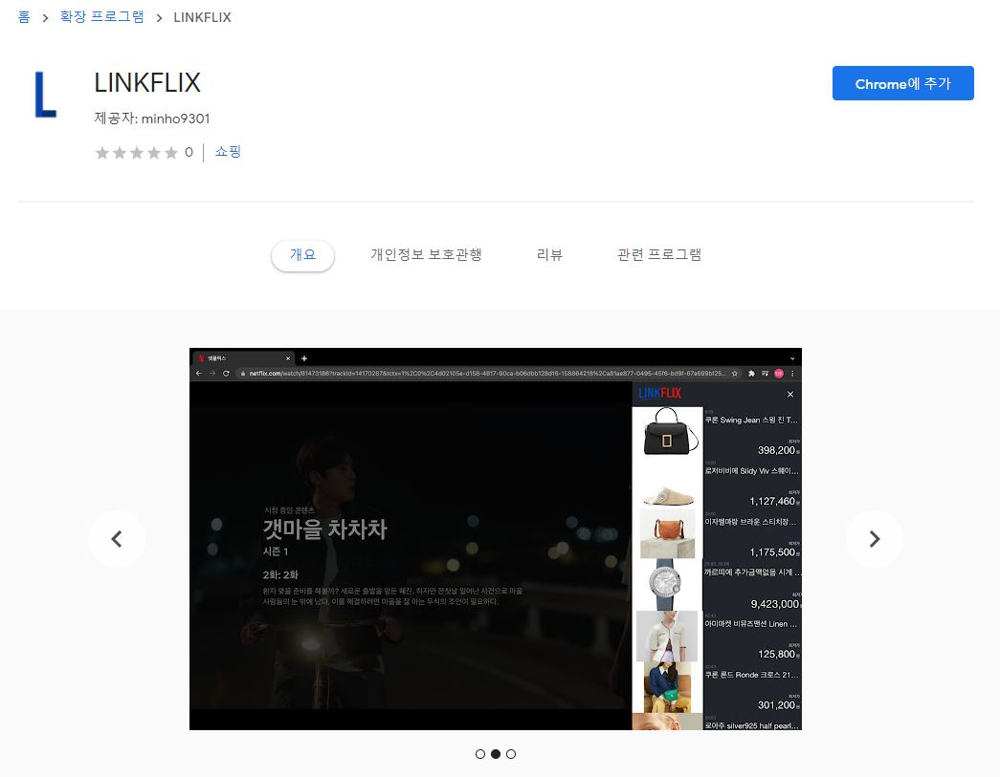
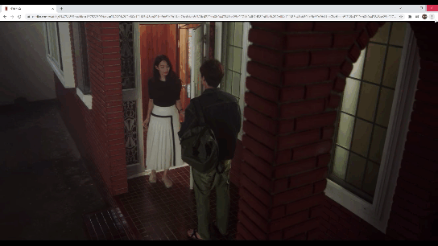
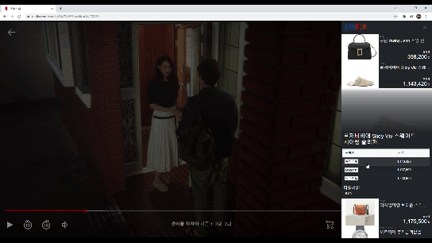
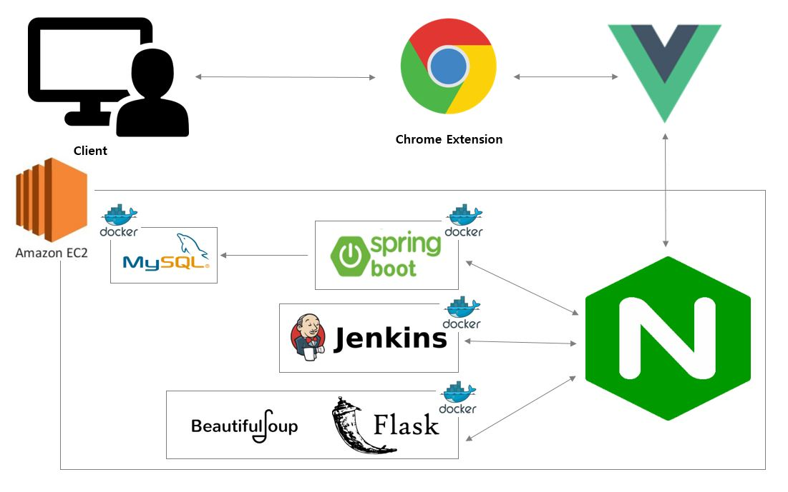

 

  </img>

 

## 🎁 LINKFLIX

- 현재 시청 중인 넷플릭스 영상 속 제품에 대해서 바로 구매 가능한 사이트로 연결해주는 **크롬 확장 프로그램**입니다.
- **Link**와 **Netflix**의 합성어로 넷플릭스와 연결된 서비스임을 의미합니다.
- 자세한 사항은 [홈페이지](https://linkflix.link)를 확인해 주세요!

## ❓ How to use

### :one: 설치

크롬 웹 스토어: <https://chrome.google.com/webstore/detail/linkflix/oipofophdaejmlneoheopbmmobmjmlkf?hl=ko>

### :two: 넷플릭스 접속 후 원하는 콘텐츠 선택

**현재 `tvN 드라마 '갯마을 차차차' 1~3화`, `영화 '기생충'` 이용 가능**  
Netflix: <https://www.netflix.com>

### :three: 영상 속 궁금했던 제품들을 확인

`출처: tvN 드라마 <갯마을 차차차>`  
</img> 

- 하단에 있는 **장바구니 버튼**을 클릭 후 보여지는 사이드바에서 해당 회차의 상품 정보를 한 번에 확인할 수 있습니다.
- 영상 속 상품이 나오는 시간은 **타임라인**에 표시되어 해당 상품을 바로 찾아볼 수 있습니다.

### :four: 실시간 가격 비교된 최저가 쇼핑몰로 연결!

</img> 

- 실시간으로 가격 비교된 쇼핑몰이 **낮은 가격 순**으로 정렬되어 보여집니다.
- 원하는 쇼핑몰을 클릭하면 해당 홈페이지로 **바로 이동**합니다.

## 🖥 Skills

- **Front-End**
  - Language
    -  
  - Framework / Library
    - 
  - Design
    - 

- **Back-End**
  - Language
    -  
  - Framework / Library
    -   
    - 

- **Deployment**
  -  

- **Collaboration Tools**
  -   

## 👨‍👩‍👦‍👦 Team

- 이채하 : Leader, BE
- 김주형 : BE(Crawling)
- 신주환 : FE
- 장민호 : FE, BE
- 정원이 : FE
